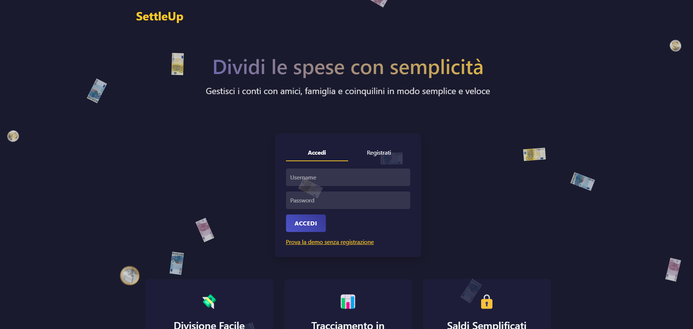

# 📌 Settle Up  
Gestisci e dividi le spese tra amici in modo semplice e organizzato.   



---

## 🚀 Tecnologie utilizzate  
- **Backend**: Node.js, Express.js  
- **Database**: MongoDB (Mongoose)  
- **Frontend**: EJS, Bootstrap  
- **Autenticazione**: Passport.js  
- **Validazione**: Joi  
- **Middleware**: Express Middleware  

---

## ⚙️ Requisiti  

Prima di procedere, assicurati di avere:  

- **Node.js** (versione più recente consigliata)  
- **MongoDB** installato e in esecuzione  

---

## 📂 Struttura del progetto  

```
settle-up/
│
├── config/               # Configurazioni varie (es. database)
├── controllers/          # Logica delle route
├── models/               # Schemi Mongoose
├── public/               # File statici (CSS, JS, immagini)
│   ├── stylesheets/      # Stili CSS
│   ├── javascript/       # Script frontend
│   └── images/           # Immagini
├── routes/               # Definizione delle API e delle pagine
├── views/                # Template EJS
│   ├── user/             # Pagine utente
│   ├── group/            # Pagine gruppo
│   ├── transaction/      # Pagine transazioni
│   ├── home.ejs          # Homepage
│   └── error.ejs         # Pagina errori
├── index.js              # Entry point dell'app
├── joiSchema.js          # Validazione con Joi
├── middleware.js         # Middleware personalizzati
└── README.md             # Documentazione
```

---

## ⚙️ Setup e Installazione

1. **Clona il repository:**

   ```bash
   git clone https://github.com/Nicmaa/SettleUp.git
   cd SettleUp
   ```

2. **Installa le dipendenze:**

   ```bash
   npm install
   ```

3. **Avvia il server:**

   ```bash
   npm start
   ```

5. **Apri il browser su:**
   
   [http://localhost:3000](http://localhost:3000)
   
---

## 🤝 Contributi  

Se vuoi contribuire al progetto:  

1. Fai un fork del repository  
2. Crea un nuovo branch: `git checkout -b feature-nuova-funzionalità`  
3. Fai le modifiche e committale: `git commit -m "Aggiunta nuova funzionalità"`  
4. Fai un push: `git push origin feature-nuova-funzionalità`  
5. Apri una pull request  

---

## 🔥 Funzionalità principali  

✅ **Gestione Gruppi** - Crea gruppi di spesa con amici  
✅ **Aggiunta Transazioni** - Registra chi ha pagato cosa  
✅ **Calcolo Automatico** - Determina i debiti tra utenti  
✅ **Autenticazione** - Login e gestione utenti  

---

## 📌 To-Do List

- [ ] Migliorare tabella debiti (responsive)
- [ ] Styling delle pagine di dettaglio (show page)
- [ ] Creare una pagina profilo per gli utenti
- [ ] Implementare notifiche (email e in-app)
- [ ] Consentire la creazione di gruppi senza altri utenti registrati
- [ ] Aggiungere più opzioni di pagamento

---

## 👤 Autore

</p>
<h3 align="center">Nicolas Maule</h3>
<p align="center">
  <a href="https://linkedin.com/in/nicolas-maule">
    
  </a>
</p>

---

## 📄 Licenza

Questo progetto è sotto licenza MIT - vedi il file [LICENSE](LICENSE) per i dettagli.
