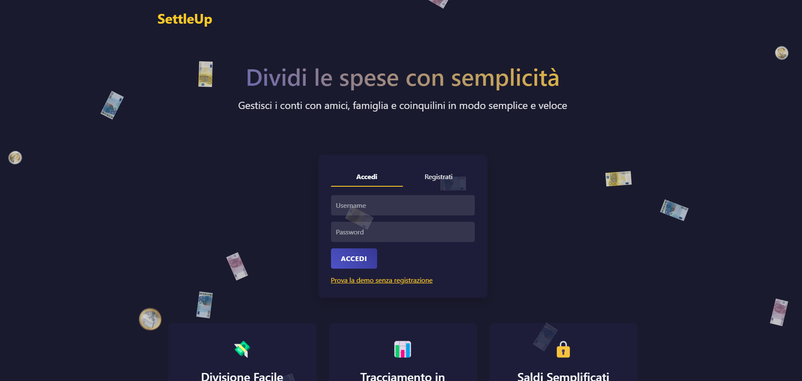

# 📌 Settle Up

Manage and split expenses with friends in a simple and organized way.



## 🚀 Technologies Used

- **Backend**: Node.js, Express.js
- **Database**: MongoDB (Mongoose)
- **Frontend**: EJS, Bootstrap
- **Authentication**: Passport.js
- **Validation**: Joi

## ⚙️ Requirements

Before proceeding, make sure you have:

- **Node.js** (latest version recommended)
- **MongoDB** installed and running

## 📂 Project Structure

```
SettleUp/src
│
├── config/               # Various configurations (e.g., database)
├── controllers/          # Route logic
├── models/               # Mongoose schemas
├── public/               # Static files (CSS, JS, images)
│   ├── css/              # CSS styles
│   ├── js/               # Frontend scripts
│   └── images/           # Images
├── routes/               # API and page definitions
├── views/                # EJS templates
│   ├── users/            # User pages
│   ├── groups/           # Group pages
│   ├── transactions/     # Transaction pages
│   ├── home.ejs          # Homepage
│   └── error.ejs         # Error page
├── index.js              # App entry point
├── joiSchema.js          # Joi validation
├── middleware.js         # Custom middleware
```

## 🔧 Setup and Installation

1. **Clone the repository:**
   ```bash
   git clone https://github.com/Nicmaa/SettleUp.git
   cd SettleUp
   ```

2. **Install dependencies:**
   ```bash
   npm install
   ```

3. **Start the server:**
   ```bash
   npm start
   ```

4. **Open your browser at:**
   [http://localhost:3000](http://localhost:3000)

## 🤝 Contributions

If you want to contribute to the project:

1. Fork the repository
2. Create a new branch: `git checkout -b feature-new-functionality`
3. Make changes and commit them: `git commit -m "Added new functionality"`
4. Push: `git push origin feature-new-functionality`
5. Open a pull request

## 🔥 Key Features

✅ **Group Management** - Create expense groups with friends  
✅ **Add Transactions** - Record who paid for what  
✅ **Automatic Calculation** - Determine debts between users  
✅ **Authentication** - Login and user management

## 📌 To-Do List

- [ ] Improve debt table (make responsive)
- [x] Style detail pages (show pages)
- [x] Create user profile page
- [ ] Implement notifications (email and in-app)
- [x] Allow creating groups without other registered users

## 👤 Author

<h3 align="center">Nicolas Maule</h3>
<p align="center">
  <a href="https://linkedin.com/in/nicolas-maule">
    
  </a>
</p>

## 📄 License

This project is licensed under the MIT License - see the [LICENSE](LICENSE) file for details.
